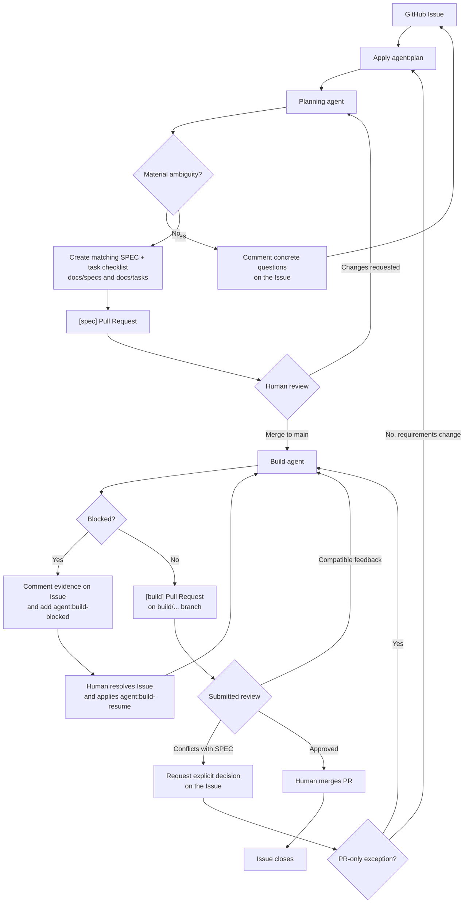

# SDLC to Agentic SLDC

A Next.js test app for documenting and managing an agentic software development lifecycle using GitHub.

## Agentic workflow

This repository uses GitHub Issues as the starting point and keeps the
planning and implementation work reviewable through separate pull requests.
The complete operational contract, including the persisted SPEC and task-file
conventions, is documented in [docs/SDLC.md](docs/SDLC.md).

1. A maintainer applies `agent:plan` to an Issue. The planning agent examines
   the Issue and repository context. Material ambiguities are sent back as
   concrete questions on the Issue; the agent does not guess or open a PR.
2. When the request is clear, the planning agent creates a matching SPEC and
   task checklist under `docs/specs/` and `docs/tasks/`, then opens one
   `[spec]` pull request for their review.
3. Merging that planning PR into `main` triggers the Build workflow. The build
   agent implements the approved tasks in order on a `build/...` branch and
   opens one `[build]` pull request only after the automated work is complete.
4. Submitted review feedback on a build PR is handled on the same branch when
   it is compatible with the approved SPEC. A conflicting product requirement
   returns to the Issue for an explicit decision or a new planning cycle.
5. A human reviews and merges the implementation PR. Its `Closes #<issue>`
   reference closes the originating Issue.

### Traceability and recovery

- Each plan has a paired SPEC and task file with the same Issue identifier.
- The implementation agent works through unchecked tasks sequentially and
  records progress in commits, so recovery is based on repository state rather
  than a previous agent conversation.
- Agents never merge pull requests. Human approval and merge remain required
  for both planning and implementation changes.
