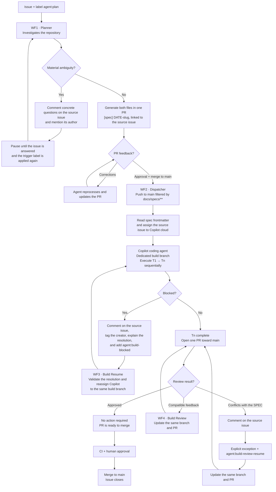

# Agentic SDLC Plan on GitHub (gh-aw)

## File convention

One SPEC and task pair per plan, linked by the issue number and the same
filename:

```
docs/
├── specs/
│   └── 2026-08-22-issue-123-user-auth-refactor.md  # the reviewable plan
└── tasks/
    └── 2026-08-22-issue-123-user-auth-refactor.md  # execution checklist
```

- `<DATE>-issue-<ISSUE_NUMBER>-<SHORT_TITLE>` is the shared identifier for
  both files.
- Both files include frontmatter with metadata: the source issue number,
  status (`planned` / `in-progress` / `blocked` / `done`), and the issue
  author's name.
- The task file groups tentative and sequential steps by phase; each step uses
  a checklist (`- [ ]` / `- [x]`) with short IDs (T1, T2...). For example:

  ```markdown
  ## Phase 1: Preparation

  - [ ] T1: Identify the affected modules
  - [ ] T2: Implement the contract change

  ## Phase 2: Verification

  - [ ] T3: Run the agreed validation
  ```

  This format allows work to resume after an error: progress is persisted in
  the repository through the commits themselves, not in the agent's memory.
- Each commit references its task (`T3: ...`) for two-way commit ↔ checklist
  traceability.

## Complete flow



## WF1 · Planner

- **Trigger**: only the `agent:plan` label on issues. Never trigger on every
  issue opening.
- **Agent**: investigates the repository from the issue and produces both
  files in the same PR — they are an inseparable review unit (approving a spec
  without its tasks does not make sense).
- **Ambiguities**: before writing, if a material definition is missing, the
  agent comments with concrete questions on the source issue and mentions its
  author. It does not guess, create files, or open a PR, and waits for an
  answer followed by a new application of the trigger label.
- **Iteration**: comments on the PR can ask the agent to make corrections on
  the planning branch.
- **Safe outputs**: `add-comment` to request clarification and
  `create-pull-request` to propose the SPEC and task pair; read-only
  permissions except for those outputs.

## WF2 · Dispatcher (lightweight workflow, almost no AI)

- **Trigger**: a push to `main` filtered to `docs/specs/**`. Deterministic: the
  merge IS the signal.
- **Work**: read the frontmatter from the newly merged spec, retrieve the
  source issue number, and assign it to **Copilot cloud** (`assign-to-agent`).
  This is simple orchestration; the heavy AI cost should be minimal or zero.
- Assigning work to Copilot cloud means that the heavy execution runs on
  GitHub infrastructure, not on your Actions runners — you only pay for the
  assignment/orchestration.

## Execution · Copilot cloud agent

- Works on a dedicated branch (`build/<date>-issue-<number>-<slug>`), executes
  the phases and checklist tasks in strict order, creates one atomic commit per
  task, and updates the checkbox in that commit.
- **Failure recovery**: because tasks live in the repository and each commit
  reflects progress, any rerun (in the same Copilot session or through a new
  issue assignment) can detect the last completed task and continue from
  there. The source of truth is the diff, never the conversation.
- **Blocking protocol**: when blocked on a task, comment on the **source issue**
  mentioning its creator, identify the task and required resolution, add
  `agent:build-blocked`, and pause. The comment explains that you must reply
  on the issue and apply `agent:build-resume`.
- **Resume**: `Build Resume` requires the `agent:build-blocked` label, a human
  resolution posted after the block, the corresponding SPEC/task, and an
  existing `build/...` branch before reassigning Copilot. It does not create a
  new branch or PR; it uses only the `agent:build-resume` label.
- **Implementation review**: an `APPROVED` review triggers no action. Comments
  compatible with the current SPEC update the same branch/PR. If a comment
  contradicts the SPEC, `Build Review` does not modify the code or SPEC; it
  records a new decision on the issue. Only an explicit exception followed by
  `agent:build-review-resume` can update that same PR; a product-requirements
  change starts a new `agent:plan` cycle.
- **Close**: once all tasks are complete, open a single PR toward `main` with
  `Closes #N` referencing the source issue. CI runs, you approve and merge it,
  and the issue closes automatically.
- Your comments on that PR also reach Copilot cloud, so post-PR iteration uses
  the standard channel.

## Cross-cutting guardrails

1. Branch protection on `main`: your approval is mandatory for both PR types
   (plan and code). No one except you merges.
2. `read-all` permissions plus sanitized `safe-outputs` in the gh-aw
   workflows; Copilot cloud operates under its own repository permission
   limits.
3. Traceability labels: `[spec]`, `[ai-generated]`, and the status in the spec
   frontmatter, which the dispatcher can update.
4. Limits: a timeout in WF1, a `max` value on safe outputs, and protection
   against WF2 double-triggering when several specs are merged together
   (concurrency by slug).

## Decisions made vs. pending

| Point | Decision |
|---|---|
| WF1 trigger | Specific label ✔ |
| Model | Defined when each workflow is created ✔ |
| Multiple PRs | One final PR (multiple PRs in the future) ✔ |
| Executor | Copilot cloud agent ✔ |
| Strategy | Sequential, dedicated branch, atomic commits ✔ |

**Minor items pending**: exact name of the trigger label, the detailed
checklist format (does it include tests/criteria per task?), and what WF2 does
if the source issue was closed or deleted before the spec was merged.

## Next steps

1. Implement WF1 and the file convention; verify the spec PR review/comment
   loop.
2. Implement WF2 and delegation to Copilot cloud.
3. Validate crash recovery and the end-to-end blocking protocol.
